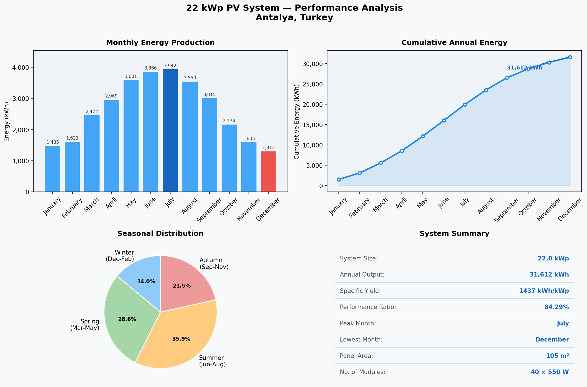

# ☀️ 22 kWp Grid-Connected PV System — Design & Analysis

This repository presents the **simulation, performance analysis, and data-driven modeling** of a 22 kWp rooftop photovoltaic system designed in **PVsyst V8.0.20** and analyzed with **Python (Pandas, Matplotlib, Scikit-learn)**.

> 📍 Location: Kömürcüler, Antalya, Turkey &nbsp;|&nbsp; 🗓️ March 2026 &nbsp;|&nbsp; 🎓 Academic & Training Use

---

## 🧾 System Overview

| Parameter | Value |
|---|---|
| **Location** | Kömürcüler, Antalya, Turkey |
| **PV Module** | TSM-DE19-550 Wp (Trina Solar Vertex) |
| **Number of Modules** | 40 |
| **Total DC Power** | 22.0 kWp |
| **Inverter Model** | Huawei SUN2000-20KTL-M2 |
| **Inverter Power (AC)** | 20.0 kWac |
| **DC/AC Ratio** | 1.10 |
| **Array Configuration** | 4 strings × 10 modules |
| **PV Tilt / Azimuth** | 7° / 0° (South-facing) |
| **PV Surface Area** | 105 m² |
| **STC Efficiency** | 21.05 % |
| **Albedo** | 0.20 |
| **Altitude** | 297 m |
| **Weather Data** | Meteonorm 8.2 (TMY 2003–2013) |

---

## 📊 Performance Summary

| Metric | Value |
|---|---|
| **Annual Energy Output (E_Grid)** | 31,613 kWh/year |
| **Specific Production** | 1,437 kWh/kWp/year |
| **Performance Ratio (PR)** | 84.29 % |
| **Thermal Loss Coefficient** | 20 W/m²K |
| **Module Mismatch Loss** | 2.0 % |
| **DC Wiring Losses** | 1.0 % |
| **Inverter Efficiency Losses** | 2.6 % |

---

## 📈 Python Performance Analysis

In addition to the PVsyst simulation, a Python-based analysis script (`analysis.py`) was developed to process the monthly energy data, visualize seasonal trends, and apply a basic machine learning model.



### What the script does

- Loads monthly production data (E_Grid) from PVsyst V8.0.20 report with **Pandas**
- Computes annual totals, specific yield, and seasonal distribution
- Generates a 4-panel dashboard with **Matplotlib**: bar chart, cumulative output, seasonal pie chart, and system summary
- Applies a **Linear Regression** model (Scikit-learn) as a baseline predictor

### Run it yourself

```bash
pip install pandas matplotlib scikit-learn
python analysis.py
```

---

## ⚡ Loss Diagram Summary

| Loss Source | Value |
|---|---|
| Global horizontal irradiation | 1,628 kWh/m² |
| Global incident in collector plane | +4.7 % |
| IAM factor on global | −3.6 % |
| Effective irradiation on collectors | 1,643 kWh/m² |
| PV loss due to irradiance level | −0.7 % |
| PV loss due to temperature | −7.0 % |
| Module quality loss | +0.4 % |
| Mismatch loss (modules & strings) | −2.0 % |
| DC ohmic wiring loss | −1.0 % |
| Array virtual energy at MPP | 32,492 kWh |
| Inverter losses (operation) | −2.6 % |
| Night consumption | −0.1 % |
| **Energy injected to grid (E_Grid)** | **31,613 kWh/year** |

---

## 📁 Repository Contents

| File | Description |
|---|---|
| `analysis.py` | Python analysis & ML script |
| `pv_analysis.png` | Output dashboard (4-panel chart) |
| `22kWp_PV_System_Simulation_Report.pdf` | Full PVsyst V8.0.20 simulation report |
| `monthly_production.xlsx` | Monthly E_Grid production data (PVsyst) |
| `system_specs.xlsx` | Design and performance summary |
| `pv_layout.dwg` | PV module layout (AutoCAD 2025) |

---

## 🧠 Notes

- System modeled as **unshaded (open rooftop)**
- Inverter loaded at 110 % DC/AC ratio — within design best practice
- Simulation performed under **PVsyst evaluation mode** for academic use
- All energy values in `analysis.py` and `monthly_production.xlsx` are taken from the **E_Grid** column of the PVsyst simulation report (energy injected into grid)

---

## 🛠️ Tools Used


---

## 👤 Author

**Gani Aksöz** — Electrical & Electronics Engineering Student  
📅 March 2026
